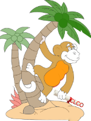
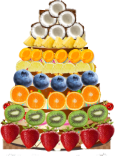
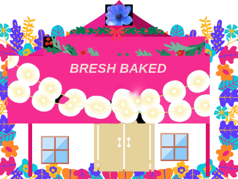

---

&nbsp;

&nbsp;

&nbsp;

&nbsp;

&nbsp;

&nbsp;

&nbsp;

# SuteCase's CLCO

[alt SuiteCase](assets/images/suitecase.png "I am SuiteCase")

<b>ramacsv,My Friend SuiteCase </b>

_My friend Suitecase was sailing and reached  Hawaii_

_And was walking along the palm tree grove in Oahu Hawaii_

------------

_An Ape sitting on the palm tree dropped a paper sheet written on top CLCO ._

<b>Created by SuiteCase Friend, ramacsv with PixelmatorPro</b>

_Find out what is [**CLCO Title**](./cake.md)   &nbsp;&nbsp;&nbsp;&nbsp;_click to see_

_It was a list of ingredients. It turned out to be a recipe for a cake_

_He read the recipe and said wow! this is what I wanted_

_He got some ingredients himself from the store_

_And some from cloud island by calling his mom_

_She sent it through cookie monster_

_This cake has seven layers with top cloud icing_

_The base is special cloud leaf made of C12H22O11 mould_ 

_The list of fruits are_

C16H11N2NaO4S 

C101H142N24O26S

C12H14O3 

C6H8O7 

C12H24O2 + CH3(CH2)12COOH + C16H32O2 + C18H34O2 + C18H32O2  

C27H31O16  

C17H16O6  

C39H66N2O29  and  C6H12O2 

[**Fruits Names**](./cake.md)   &nbsp;&nbsp;&nbsp;&nbsp;     _click to see_

_The fun part is collecting all the ingredients, he took it to cookie monster and gonger kitchen_

_Cookie maonster started help with mixing flour_

_While sifting and stirring the flour he scaterred it all over the place and on himself too
_

-So Suitecase had to clean up and started mixing by himself_

_For the cake he used flour, milk powder, butter, salt, sugar,_

_baking power, and his secret ingredient too_

_that gives a special taste_

_the top was small_

_the 2nd layer a little bigger_

_the 3rd layer bigger than second_

_4th  bigger than 3rd_

_5th  bigger than  4th_

_6th  bigger than 5th_

_7th the  bigger than 6th_

_Each layer has one kind of fruit_

_To bake the cake Suitecase flew near the sun with the cake in a baking tray_

_The tray got hot and baked the cake_

_It started coming down_

_Finally here it is_

<b>Created by SuiteCase Friend, ramacsv with PixelmatorPro</b>

_He put up a big tent on the baech_

_He deorated the tent and put chairs and table with lots of goody's_

<b>Created by SuiteCase Friend, ramacsv with PixelmatorPro</b>

_The fun part is the cake came through the top opening in the tent and landed on the decorated table_

_Every one was surprised the way it was done_

_All were very happy to see such an unusual cake and the tase was very unique_

_cookie monster came flying in his helicopter along with friends_

_Everyone thanked Suitecase_

_Suitecase also sent some cake to his mom_

_The CLCO cake turned out be very good_

# The End

## Hope you like my story

### *Thank You for Visiting*

